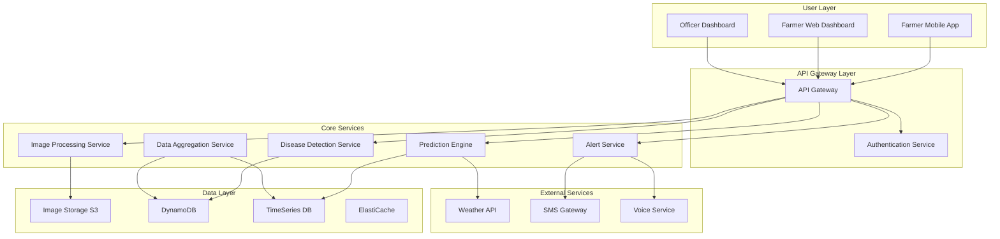

# Design Document: KrishiRakshak AI

## Overview

KrishiRakshak AI is a serverless, AI-powered early warning system designed to help rice farmers in Andhra Pradesh detect crop diseases early and prevent yield losses. The system combines computer vision for disease detection, time-series forecasting for outbreak prediction, and multilingual communication to deliver actionable insights to farmers and agricultural officers.

The architecture leverages modern cloud-native technologies to ensure scalability, cost-effectiveness, and reliability while addressing the unique constraints of rural farming communities, including limited connectivity and varying digital literacy levels.

## Architecture

### High-Level Architecture



### Serverless Architecture Pattern

The system follows an event-driven serverless architecture using AWS Lambda functions, ensuring automatic scaling and cost optimization:

- **API Gateway**: Routes requests and handles authentication
- **Lambda Functions**: Process business logic with automatic scaling
- **S3**: Stores images with event triggers for processing
- **DynamoDB**: Handles structured data with global secondary indexes
- **SQS**: Manages asynchronous processing queues
- **EventBridge**: Orchestrates cross-service communication

## Components and Interfaces

### 1. Image Processing Service

**Purpose**: Handles image upload, validation, preprocessing, and storage.

**Key Functions**:
- Image validation (format, size, quality)
- Image preprocessing (resize, normalize, enhance)
- Metadata extraction and storage
- Trigger disease detection pipeline

**Interface**:
```
POST /api/v1/images/upload
Headers: Authorization, Content-Type: multipart/form-data
Body: image file, farmer_id, location, timestamp
Response: {image_id, status, processing_queue_id}

GET /api/v1/images/{image_id}/status
Response: {status, confidence_score, detected_diseases, recommendations}
```

**Implementation Details**:
- Lambda function triggered by S3 upload events
- Image validation using PIL/OpenCV
- Automatic image optimization for mobile networks
- Asynchronous processing with SQS queues

### 2. Disease Detection Service

**Purpose**: AI-powered disease identification using computer vision models.

**Key Functions**:
- Load and run CNN models (MobileNetV2/DenseNet121 based on research)
- Multi-disease classification with confidence scores
- Generate treatment recommendations
- Update disease occurrence database

**Interface**:
```
POST /api/v1/detection/analyze
Body: {image_id, farmer_id, location}
Response: {
  diseases: [{name, confidence, severity, treatment}],
  overall_health_score,
  recommendations: [string],
  follow_up_required: boolean
}
```

**Model Architecture**:
- Primary: MobileNetV2 (90%+ accuracy, mobile-optimized)
- Backup: DenseNet121 (higher accuracy, more compute)
- Supports: Rice Blast, Brown Spot, Bacterial Blight, Leaf Scald
- Model versioning and A/B testing capability

### 3. Prediction Engine

**Purpose**: Time-series forecasting for disease outbreak risk assessment.

**Key Functions**:
- Analyze historical disease patterns
- Incorporate weather data and seasonal factors
- Generate 7-14 day risk forecasts
- Identify high-risk geographical clusters

**Interface**:
```
GET /api/v1/predictions/risk/{district_id}
Response: {
  current_risk_level: "low|medium|high|critical",
  forecast_days: 14,
  risk_timeline: [{date, risk_score, primary_diseases}],
  weather_factors: {temperature, humidity, rainfall},
  recommendations: [string]
}

POST /api/v1/predictions/update
Body: {new_detection_data, weather_updates}
Response: {updated_forecasts, affected_districts}
```

**Forecasting Models**:
- LSTM networks for temporal pattern recognition
- Weather integration using external APIs
- Ensemble methods combining multiple predictors
- Real-time model updates with new detection data

### 4. Alert and Notification Service

**Purpose**: Multi-channel communication system for farmers and officers.

**Key Functions**:
- Generate personalized alerts based on risk levels
- Deliver messages via SMS, voice calls, and app notifications
- Support Telugu language with voice synthesis
- Track delivery status and farmer responses

**Interface**:
```
POST /api/v1/alerts/send
Body: {
  recipients: [farmer_ids],
  message_type: "disease_alert|prevention|treatment",
  urgency: "low|medium|high|critical",
  content: {text_te, voice_te, images}
}

GET /api/v1/alerts/farmer/{farmer_id}/history
Response: {alerts: [{id, timestamp, type, status, response}]}
```

**Communication Channels**:
- SMS: Cost-effective, wide reach
- Voice calls: For critical alerts, accessibility
- Push notifications: Real-time app updates
- Offline sync: Cache messages for poor connectivity

### 5. Data Aggregation Service

**Purpose**: District-level data processing and analytics for officers.

**Key Functions**:
- Aggregate disease detection data by geography and time
- Generate statistical reports and trends
- Maintain farmer privacy through anonymization
- Support government reporting requirements

**Interface**:
```
GET /api/v1/analytics/district/{district_id}/summary
Query: start_date, end_date, disease_types
Response: {
  total_detections,
  disease_breakdown: {disease: count},
  affected_area_hectares,
  farmer_response_rate,
  intervention_effectiveness
}

GET /api/v1/analytics/trends/outbreak-risk
Response: {
  high_risk_districts: [district_info],
  emerging_patterns: [pattern_description],
  seasonal_comparisons: historical_data
}
```

## Data Models

### Core Entities

**Farmer Profile**:
```json
{
  "farmer_id": "string (UUID)",
  "name": "string",
  "phone": "string",
  "district": "string",
  "village": "string",
  "farm_size_hectares": "number",
  "preferred_language": "te|en",
  "communication_preference": "sms|voice|app",
  "registration_date": "timestamp",
  "last_active": "timestamp"
}
```

**Image Record**:
```json
{
  "image_id": "string (UUID)",
  "farmer_id": "string",
  "s3_url": "string",
  "upload_timestamp": "timestamp",
  "location": {
    "latitude": "number",
    "longitude": "number",
    "district": "string",
    "village": "string"
  },
  "image_metadata": {
    "size_bytes": "number",
    "format": "string",
    "quality_score": "number"
  },
  "processing_status": "uploaded|processing|completed|failed"
}
```

**Disease Detection**:
```json
{
  "detection_id": "string (UUID)",
  "image_id": "string",
  "farmer_id": "string",
  "timestamp": "timestamp",
  "detected_diseases": [
    {
      "disease_name": "string",
      "confidence_score": "number (0-1)",
      "severity": "mild|moderate|severe",
      "affected_area_percentage": "number"
    }
  ],
  "overall_health_score": "number (0-100)",
  "recommendations": ["string"],
  "model_version": "string"
}
```

**Risk Forecast**:
```json
{
  "forecast_id": "string (UUID)",
  "district_id": "string",
  "generated_timestamp": "timestamp",
  "forecast_period": {
    "start_date": "date",
    "end_date": "date"
  },
  "risk_timeline": [
    {
      "date": "date",
      "overall_risk_score": "number (0-100)",
      "disease_risks": {
        "blast": "number",
        "brown_spot": "number",
        "bacterial_blight": "number"
      },
      "weather_factors": {
        "temperature_avg": "number",
        "humidity_avg": "number",
        "rainfall_mm": "number"
      }
    }
  ],
  "confidence_level": "number (0-1)"
}
```

### Database Design

**DynamoDB Tables**:

1. **Farmers Table**
   - Partition Key: farmer_id
   - GSI: district-index (district, last_active)

2. **Images Table**
   - Partition Key: image_id
   - GSI: farmer-timestamp-index (farmer_id, upload_timestamp)
   - GSI: location-index (district, upload_timestamp)

3. **Detections Table**
   - Partition Key: detection_id
   - GSI: farmer-timestamp-index (farmer_id, timestamp)
   - GSI: district-timestamp-index (district, timestamp)

**TimeSeries Database** (Amazon Timestream):
- Disease occurrence metrics by location and time
- Weather data integration
- Risk score calculations and trends
- Performance metrics and system monitoring

## Correctness Properties

*A property is a characteristic or behavior that should hold true across all valid executions of a system—essentially, a formal statement about what the system should do. Properties serve as the bridge between human-readable specifications and machine-verifiable correctness guarantees.*

Before defining the correctness properties, I need to analyze the acceptance criteria from the requirements to determine which ones are testable as properties.

### Property 1: System Response Time Consistency
*For any* valid farmer request (image upload, dashboard access, alert retrieval), the system response time should be under 30 seconds regardless of load conditions or peak usage periods.
**Validates: Requirements 1.1, 7.3**

### Property 2: Image Quality Validation
*For any* uploaded image with insufficient quality (blur, low resolution, poor lighting, wrong format), the system should reject it and provide specific guidance for improvement.
**Validates: Requirements 1.2**

### Property 3: Disease Detection Response Completeness
*For any* image where diseases are detected, the response should always contain confidence scores, severity rankings, and actionable treatment recommendations.
**Validates: Requirements 1.3, 1.4**

### Property 4: Comprehensive Disease Recognition
*For any* image containing rice blast, brown spot, or bacterial blight diseases, the system should correctly identify and classify the disease with appropriate confidence levels.
**Validates: Requirements 1.5**

### Property 5: Data Aggregation Consistency
*For any* disease detection event, the data should be automatically aggregated by location and time while maintaining farmer anonymity in all aggregated outputs.
**Validates: Requirements 2.1, 2.2, 9.3**

### Property 6: Automated Reporting and Alerting
*For any* district with disease clusters exceeding risk thresholds, the system should automatically generate reports every 6 hours and trigger immediate alerts to relevant officers.
**Validates: Requirements 2.3, 2.4, 6.2**

### Property 7: Prediction Engine Accuracy and Timeliness
*For any* set of historical and current disease data, the prediction engine should generate 7-14 day forecasts with at least 70% accuracy and incorporate weather and seasonal factors.
**Validates: Requirements 3.1, 3.2, 3.4, 3.5**

### Property 8: Alert Triggering Consistency
*For any* outbreak risk exceeding defined thresholds, community-wide alerts should be automatically triggered with appropriate urgency levels.
**Validates: Requirements 3.3**

### Property 9: Telugu Language Consistency
*For any* farmer communication (alerts, voice guidance, dashboard help), the content should be delivered in Telugu using simple, non-technical language appropriate for the target audience.
**Validates: Requirements 4.1, 4.2, 4.3, 5.3**

### Property 10: Local Relevance of Recommendations
*For any* treatment recommendation provided to farmers, the suggested solutions and products should be locally available in Andhra Pradesh markets.
**Validates: Requirements 4.5**

### Property 11: Offline Functionality Completeness
*For any* farmer operating without internet connectivity, the system should allow image capture, cache essential information, provide basic guidance, and automatically sync when connectivity is restored.
**Validates: Requirements 4.4, 5.5, 8.1, 8.2, 8.3, 8.4**

### Property 12: Dashboard Content Appropriateness
*For any* user login (farmer or officer), the dashboard should display role-appropriate information with visual indicators suitable for the user's literacy level and device capabilities.
**Validates: Requirements 5.1, 5.2, 5.4, 6.1**

### Property 13: Broadcast and Tracking Functionality
*For any* advisory broadcast or intervention, the system should successfully deliver to targeted farmer groups and track response rates and effectiveness metrics.
**Validates: Requirements 6.3, 6.5**

### Property 14: Government Reporting Compliance
*For any* generated report, the format and content should meet government reporting requirements and standards for agricultural data.
**Validates: Requirements 6.4**

### Property 15: Scalability and Auto-scaling
*For any* increase in system load (concurrent users, image uploads), the system should automatically scale processing capacity while maintaining performance standards up to 10,000 concurrent users.
**Validates: Requirements 7.1, 7.2**

### Property 16: Fault Tolerance and Graceful Degradation
*For any* system component failure, the overall system should continue operating with reduced functionality rather than complete failure.
**Validates: Requirements 7.4**

### Property 17: Data Protection and Privacy Compliance
*For any* farmer data (images, personal information, farm data), the system should encrypt during transmission and storage, comply with Indian data protection regulations, and allow farmer-initiated data deletion.
**Validates: Requirements 9.1, 9.2, 9.4, 9.5**

### Property 18: Network Optimization
*For any* data transmission on slow 2G/3G connections, the system should optimize data usage while maintaining functionality and user experience.
**Validates: Requirements 8.5**

### Property 19: Cost-Effective Operations
*For any* system operation (processing, storage, notifications), the architecture should utilize serverless components, intelligent caching, and cost-effective channels while maintaining service quality.
**Validates: Requirements 10.1, 10.2, 10.3, 10.4**

### Property 20: Analytics and Optimization
*For any* system usage pattern, comprehensive analytics should be available to support resource allocation decisions and cost management optimization.
**Validates: Requirements 10.5**

## Error Handling

### Image Processing Errors
- **Invalid Format**: Return specific error codes with format requirements
- **File Size Limits**: Implement progressive compression with quality warnings
- **Corruption Detection**: Use checksums and validation before processing
- **Processing Timeouts**: Implement circuit breakers with retry mechanisms

### AI Model Errors
- **Model Unavailability**: Fallback to cached results or alternative models
- **Low Confidence Scores**: Request additional images or manual verification
- **Model Version Conflicts**: Maintain backward compatibility and graceful upgrades
- **Resource Exhaustion**: Queue management with priority-based processing

### Network and Connectivity Errors
- **Offline Mode**: Comprehensive caching strategy with sync queues
- **Partial Connectivity**: Adaptive quality and progressive data loading
- **API Failures**: Exponential backoff with circuit breaker patterns
- **Third-party Service Outages**: Graceful degradation with cached data

### Data Consistency Errors
- **Concurrent Updates**: Optimistic locking with conflict resolution
- **Data Corruption**: Checksums and validation at multiple layers
- **Sync Conflicts**: Last-writer-wins with conflict logging
- **Schema Evolution**: Backward-compatible migrations with versioning

## Testing Strategy

### Dual Testing Approach

The testing strategy employs both unit testing and property-based testing to ensure comprehensive coverage:

**Unit Tests**: Focus on specific examples, edge cases, and integration points
- Disease detection accuracy with known test images
- API endpoint validation with specific payloads
- Error handling scenarios with controlled inputs
- Integration between services with mock data

**Property-Based Tests**: Verify universal properties across all inputs
- Generate random crop images to test detection consistency
- Create various farmer profiles to test personalization
- Simulate different network conditions for offline functionality
- Test scalability with generated load patterns

### Property-Based Testing Configuration

**Framework**: Hypothesis (Python) for backend services, fast-check (TypeScript) for frontend components

**Test Configuration**:
- Minimum 100 iterations per property test
- Each test tagged with feature reference: **Feature: krishirakshak-ai, Property {number}: {property_text}**
- Comprehensive input generation covering edge cases
- Shrinking enabled for minimal failing examples

**Key Testing Areas**:

1. **Image Processing Properties**
   - Generate images with various quality levels, formats, and sizes
   - Test disease detection consistency across image variations
   - Validate response time properties under different loads

2. **Data Aggregation Properties**
   - Generate random detection events across districts and time periods
   - Test privacy preservation in aggregated outputs
   - Validate report generation timing and content

3. **Prediction Engine Properties**
   - Generate historical disease patterns and weather data
   - Test forecast accuracy and consistency
   - Validate alert triggering thresholds

4. **Communication Properties**
   - Generate various farmer profiles and preferences
   - Test Telugu language consistency across all communications
   - Validate offline functionality with different connectivity scenarios

5. **Security and Privacy Properties**
   - Test data encryption across all transmission paths
   - Validate anonymization in aggregated data
   - Test data deletion and compliance requirements

### Integration Testing

**End-to-End Scenarios**:
- Complete farmer journey from image upload to treatment recommendation
- Officer workflow from outbreak detection to community alert
- System behavior during peak usage and component failures
- Cross-service communication and data consistency

**Performance Testing**:
- Load testing with 10,000+ concurrent users
- Stress testing of AI model inference under high volume
- Network simulation for 2G/3G connectivity scenarios
- Cost optimization validation under various usage patterns

### Monitoring and Observability

**Key Metrics**:
- Disease detection accuracy and confidence distributions
- System response times and availability
- Farmer engagement and response rates
- Cost per detection and operational efficiency

**Alerting Thresholds**:
- Response time > 25 seconds (warning), > 30 seconds (critical)
- Detection accuracy < 75% (warning), < 70% (critical)
- System availability < 99% (warning), < 95% (critical)
- Cost per detection exceeding budget thresholds

The comprehensive testing strategy ensures that KrishiRakshak AI meets its reliability, performance, and cost-effectiveness goals while serving the critical needs of rice farmers in Andhra Pradesh.